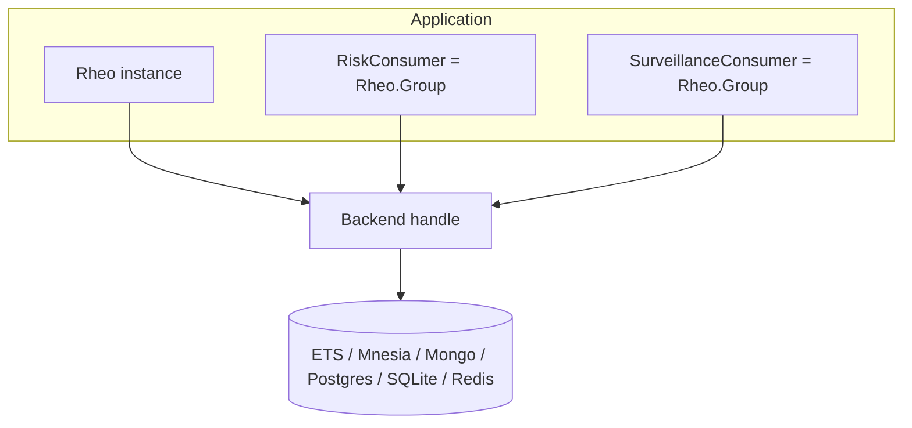
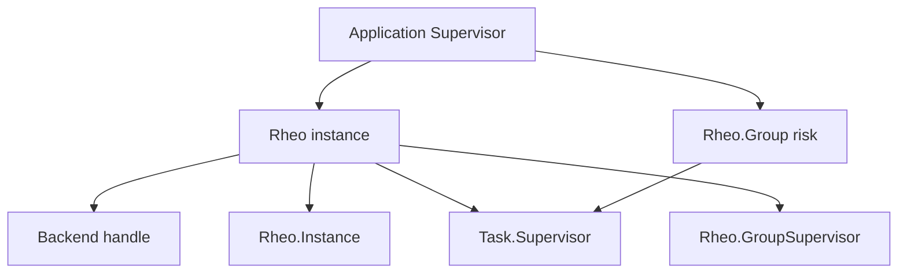
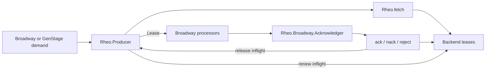
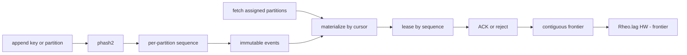
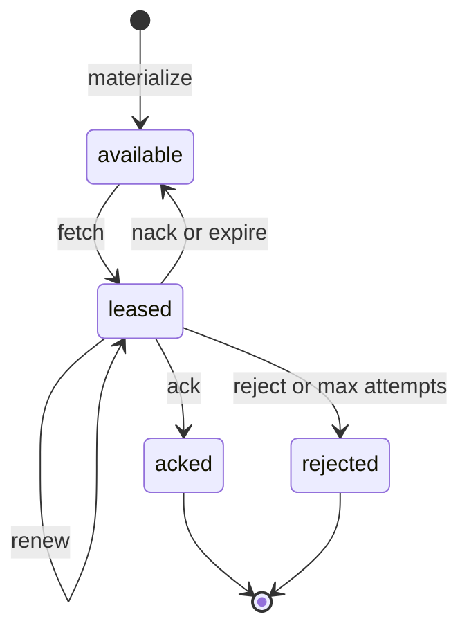
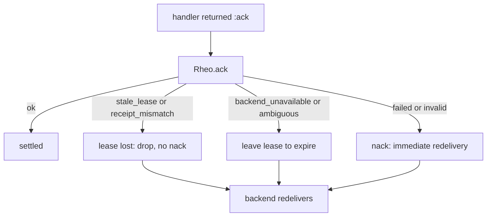
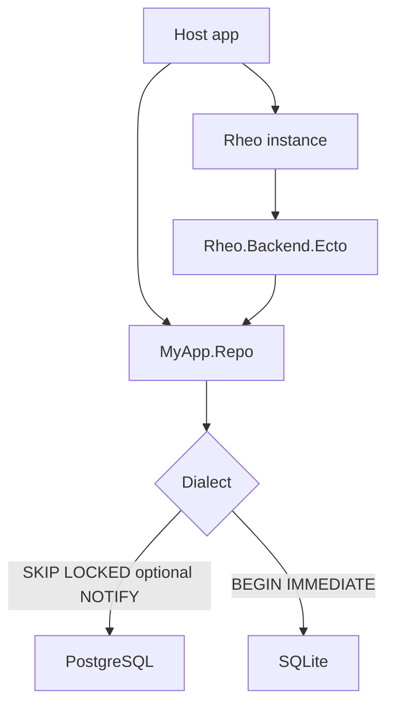
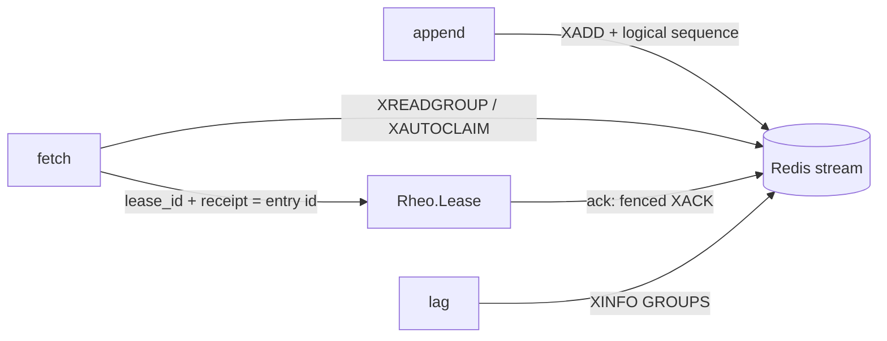

# Architecture

Rheo is an embedded Elixir/OTP library. Durable truth lives in the backend;
OTP owns process lifecycle and concurrency, not consumer-group correctness.

Shipping backends: **ETS** (ephemeral), **Mnesia** (single-node `disc_copies`),
**MongoDB**, **PostgreSQL / SQLite** via host-owned Ecto, and **Redis Streams**.
Multi-node competing groups need a shared store (Redis or Postgres); ETS,
SQLite, and Mnesia v0.11 are single-node (`distributed: false`).

`use Rheo.Consumer` produces a child spec for `Rheo.Group`, so the host
supervisor owns each local group runtime. One Group per `{rheo, stream, group}`
runs per node (ADR 022).

## OTP supervision

The host supervisor owns each `Rheo.Group`. Under the Rheo instance: the
backend handle, `Rheo.Instance` (module + handle), a `Task.Supervisor` for
handler work, and `Rheo.GroupSupervisor` for groups started dynamically via
`Rheo.GroupSupervisor.start_group/2` only.

Broadway (or plain GenStage) is an alternative consumption surface for the same
durable group. `Rheo.Producer` replaces the Group's handler runtime rather than
wrapping it:

The producer owns fetch and renewal; the acknowledger settles each lease with
`Rheo.Producer.ack/3`, `nack/4`, or `reject/4`, which also release the
producer's inflight entry so renewal stops and demand is freed
([ADR 018](https://github.com/thanos/rheo/blob/main/docs/adr/018-broadway-genstage-interop.md)).

## Core invariant

| Concept | Storage | Mutability |
|---|---|---|
| Event | `events` / `rheo_events` | Immutable |
| Per-partition sequence | stream counters / `rheo_stream_sequences` | Monotonic per partition |
| Materialization cursors | `groups.cursors` | How far deliveries were offered |
| Committed frontiers | `groups.frontiers` | Contiguous terminal progress |
| Lease / ACK / DLQ | `deliveries` / `rheo_deliveries` | Mutable per group+event |

Consumption never deletes events. An event may be processed independently by many
groups. Ordering is guaranteed within a partition only.

A hole (ACK 1001, inflight 1002, ACK 1003) keeps the frontier at 1001 until
1002 is terminal. See the [partitions and lag](partitions-and-lag.html) guide.

## Delivery

At-least-once with lease fencing:

1. `fetch` claims work with a unique `lease_id` and an opaque `receipt`
2. `ack` succeeds only if the lease token (and receipt) still match
3. Inflight leases are renewed by the Group or Producer (about half `lease_ms`)
4. Expired leases become eligible for redelivery
5. Stale consumers cannot ACK a newer lease
6. Contiguous frontier advances on ACK/reject; holes block `Rheo.lag/3`

## Settlement

A handler can succeed and the ACK can still fail. `Rheo.Settle` classifies
every settle, renew, and fetch error into a portable vocabulary
(`:stale_lease`, `:receipt_mismatch`, `:backend_unavailable`,
`{:ambiguous, _}`, `{:failed, _}`, `{:invalid, _}`), and the runtime decides
from it: a lost lease is dropped, a definite failure is nacked for immediate
redelivery, an unavailable or ambiguous outcome is left to expire so fencing
protects a possibly-committed ACK. Telemetry carries the classified reason.

Fencing makes every branch safe under at-least-once
([ADR 024](https://hexdocs.pm/rheo/024-backend-contract-v2.html)).

## Shared runtime pieces

`Rheo.Group` and `Rheo.Producer` are different processes with different
external contracts, but they share `Rheo.Inflight` (inflight set, capacity,
`renew_all/2`), `Rheo.Backoff` (fetch-failure schedule), and `Rheo.Settle`.
Draining in both is non-blocking: the caller is answered when inflight work
settles or the timeout fires, while renewals keep running.

## Demand and concurrency

`Rheo.Group` bounds outstanding leases with `:max_demand` and parallel handler
tasks with `:concurrency`. Groups may take a static `:partitions` assignment
(`:all` or a list); automatic rebalancing is deferred.

`Rheo.Producer` applies the same `:max_demand` bound to GenStage demand: it
fetches at most `min(demand, max_demand - inflight)` leases, renews what is
inflight, and releases entries through `Rheo.Producer.ack/3`, `nack/4`,
`reject/4` (or `confirm/2`). Pipeline concurrency belongs to Broadway
([ADR 018](https://github.com/thanos/rheo/blob/main/docs/adr/018-broadway-genstage-interop.md)).

## Backend boundary

`Rheo.Backend` defines semantic operations over an opaque `handle` plus a
validated `Rheo.Backend.Capabilities` declaration (guarantees vs mechanisms,
[ADR 023](https://hexdocs.pm/rheo/023-backend-capabilities-v2.html)).
Implementations: `Rheo.Backend.ETS`, `Rheo.Backend.Mnesia`, `Rheo.Backend.Mongo`,
`Rheo.Backend.Ecto` (PostgreSQL / SQLite), and `Rheo.Backend.Redis`. Queries use
portable `%Rheo.Query{}` with pagination (`query_page` / `stream_query`).
Replay/reset re-drive per-group deliveries without copying events.
Partitions use per-partition sequences and a contiguous ACK frontier.

### Ecto SQL

The host owns the Repo. Mongo stays on `Rheo.Backend.Mongo`; Ecto here means
SQL only ([ADR 017](https://github.com/thanos/rheo/blob/main/docs/adr/017-ecto-backend.md)).

### Redis Streams

The portable `event.sequence` and the frontier stay in Rheo; the stream entry
id travels in `lease.receipt`
([ADR 021](https://hexdocs.pm/rheo/021-logical-sequence-and-native-delivery-receipts.html)).

## Optional integrations

`rheo` is one package. Mongo, Ecto, Redis, Producer, and Broadway modules compile
only when the host lists the matching optional deps; core depends on
`telemetry` and `jason` only (`:mnesia` is OTP, loaded via included applications).
`mix core.check` builds a project on Rheo with none of the Hex optionals
([ADR 020](https://hexdocs.pm/rheo/020-package-and-dependency-boundaries.html)).

## Try it

- CLI: `mix rheo.demo`
- Interactive: [Livebook demos](https://hexdocs.pm/rheo/rheo_demo.html)
  ([source index](https://github.com/thanos/rheo/blob/main/notebooks/rheo_demo.livemd))
- Upgrading: [Upgrading](https://hexdocs.pm/rheo/upgrading.html)
- Changelog: [CHANGELOG](https://hexdocs.pm/rheo/changelog.html)
- Roadmap: [roadmap](https://hexdocs.pm/rheo/roadmap.html)
