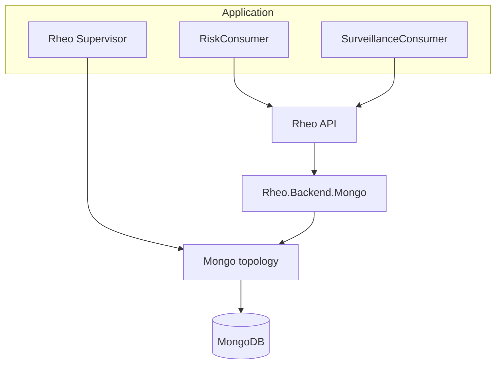
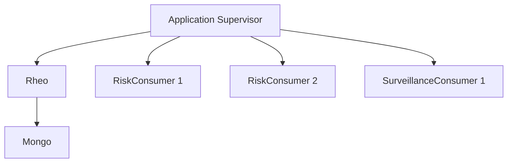
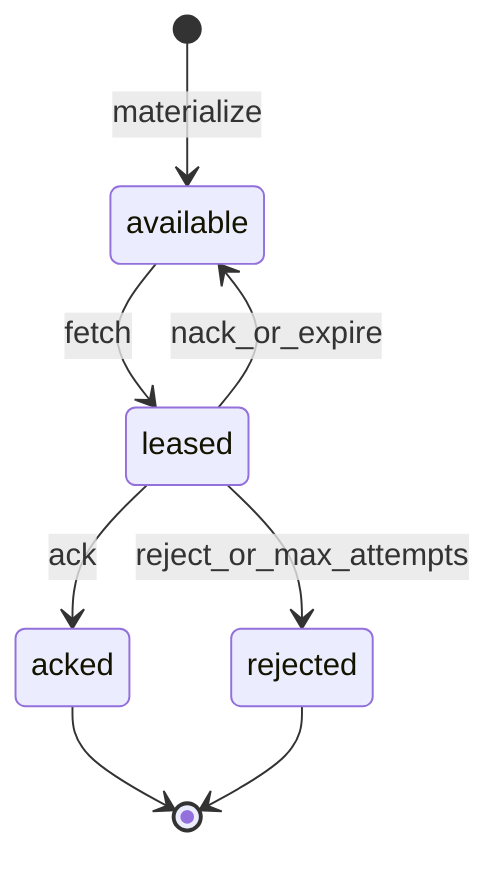
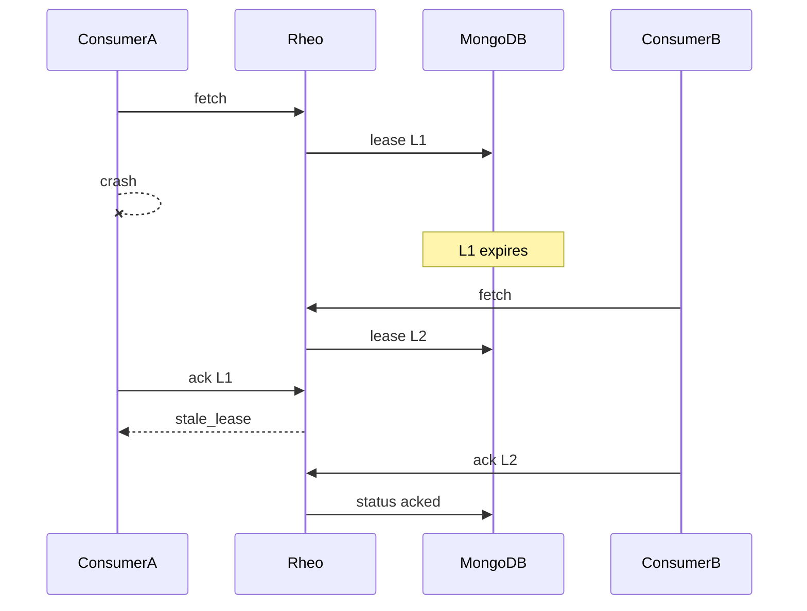

# Diagrams

## Overall architecture

```mermaid
flowchart TB
  subgraph app [Application]
    RheoSup[Rheo Supervisor]
    Risk[RiskConsumer]
    Surv[SurveillanceConsumer]
  end
  RheoSup --> MongoTop[Mongo topology]
  Risk --> API[Rheo API]
  Surv --> API
  API --> Backend[Rheo.Backend.Mongo]
  Backend --> MongoTop
  MongoTop --> DB[(MongoDB)]
```

## OTP supervision

```mermaid
flowchart TB
  AppSup[Application Supervisor]
  AppSup --> RheoSup[Rheo]
  AppSup --> C1[RiskConsumer 1]
  AppSup --> C2[RiskConsumer 2]
  AppSup --> C3[SurveillanceConsumer 1]
  RheoSup --> Topo[Mongo]
```

## Lease lifecycle

```mermaid
stateDiagram-v2
  [*] --> available: materialize
  available --> leased: fetch
  leased --> acked: ack
  leased --> available: nack_or_expire
  leased --> rejected: reject_or_max_attempts
  acked --> [*]
  rejected --> [*]
```

## Failure / redelivery

```mermaid
sequenceDiagram
  participant A as ConsumerA
  participant R as Rheo
  participant M as MongoDB
  participant B as ConsumerB
  A->>R: fetch
  R->>M: lease L1
  A--xA: crash
  Note over M: L1 expires
  B->>R: fetch
  R->>M: lease L2
  A->>R: ack L1
  R-->>A: stale_lease
  B->>R: ack L2
  R->>M: status acked
```
