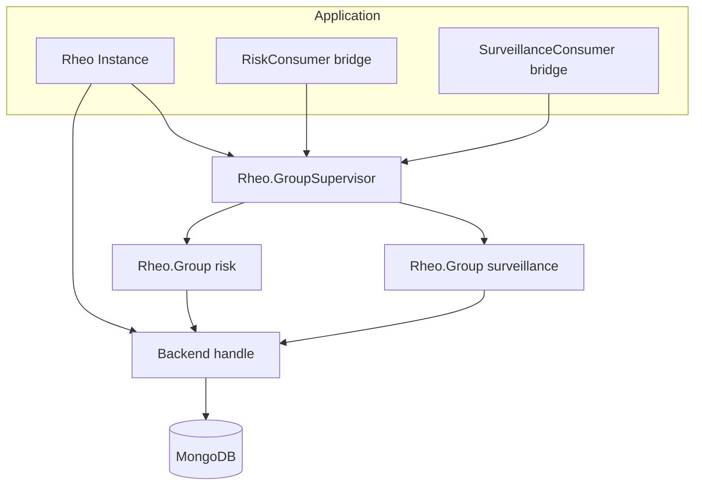
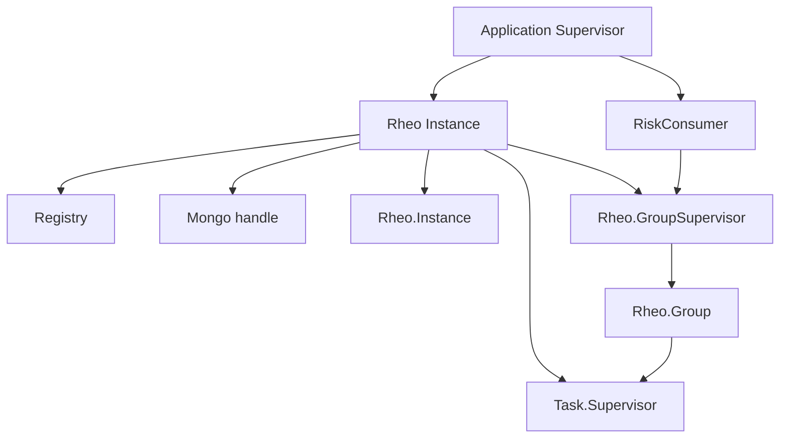
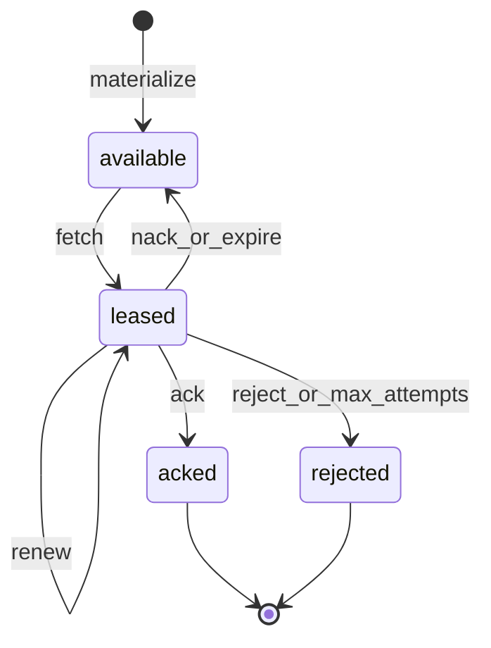
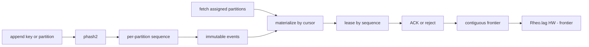

# Diagrams

## Overall architecture

## OTP supervision

## Lease lifecycle

## Partitions and ACK frontier (v0.5)

Ordering is within a partition only. A hole (ACK 1001, inflight 1002, ACK 1003)
keeps the frontier at 1001 until 1002 is terminal.
