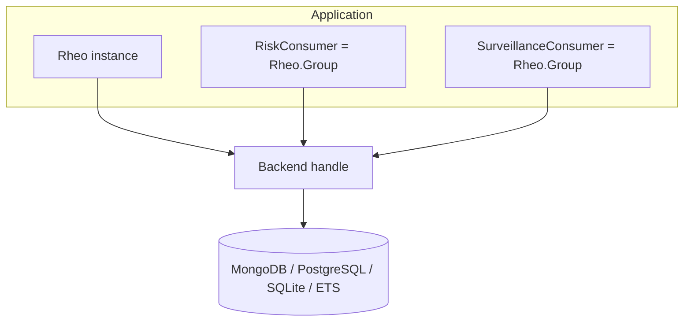
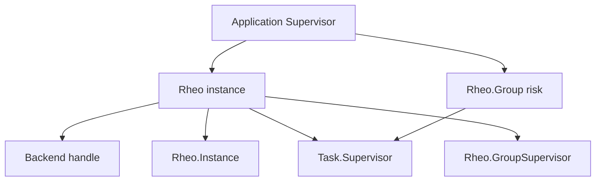
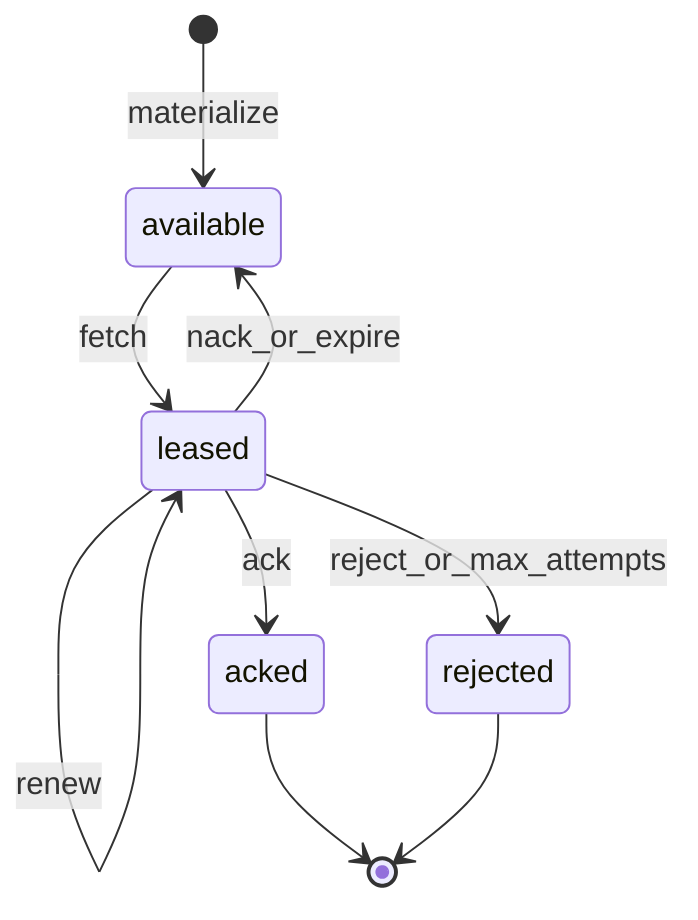
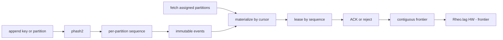
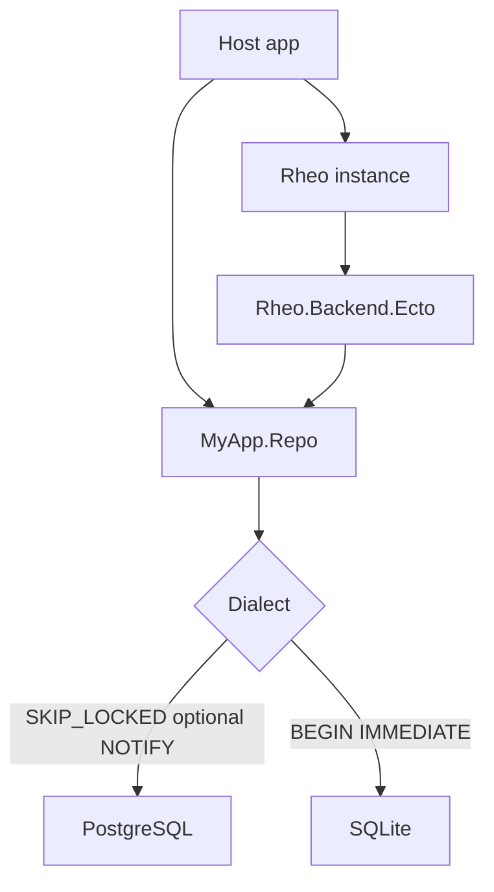
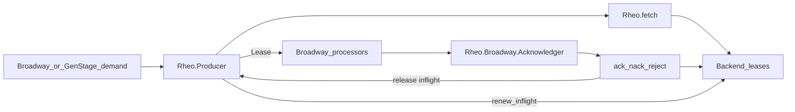
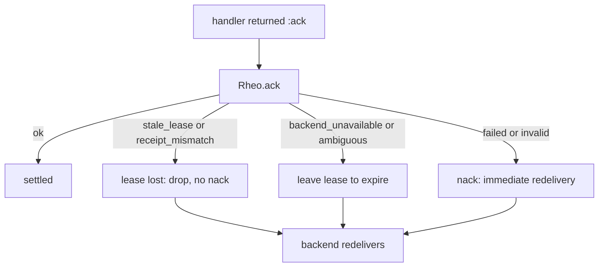
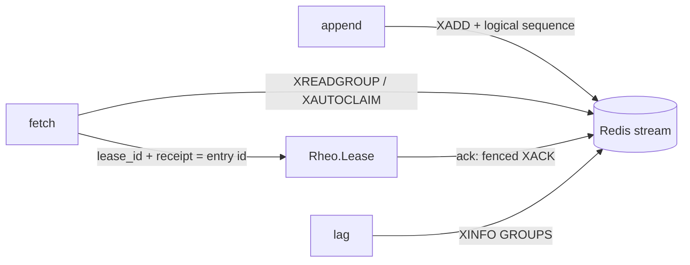

# Architecture and Flow Diagrams

Mermaid diagrams for Rheo architecture and flows. On HexDocs they render via
ExDoc's Mermaid integration; on GitHub they render natively in Markdown preview.

## Overall architecture

## OTP supervision

The host supervisor owns each `Rheo.Group`; `Rheo.GroupSupervisor` only holds
groups started dynamically through `Rheo.GroupSupervisor`.

## Lease lifecycle

## Partitions and ACK frontier (v0.5)

Ordering is within a partition only. A hole (ACK 1001, inflight 1002, ACK 1003)
keeps the frontier at 1001 until 1002 is terminal.

## Ecto SQL backends (v0.6)

The host owns the Repo. Mongo stays on `Rheo.Backend.Mongo`; Ecto here means
SQL only (see ADR 017).

## Broadway / GenStage interop (v0.7)

The producer owns fetch and renewal; the acknowledger settles each lease with
`Rheo.Producer.ack/3`, `nack/4`, or `reject/4`, which also release the
producer's inflight entry so renewal stops and demand is freed (see ADR 018).

## Settlement failure policy (v0.8)

`Rheo.Settle` classifies the error; fencing makes every branch safe under
at-least-once (see ADR 024).

## Native-stream backend shape (design for v0.9)

The portable `event.sequence` and the frontier stay in Rheo; the entry id
travels in `lease.receipt` (see ADR 021).
