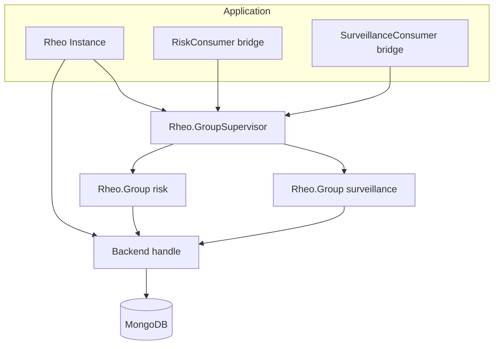
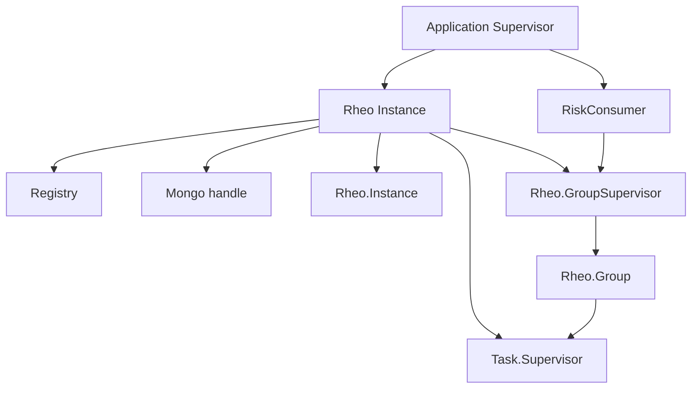
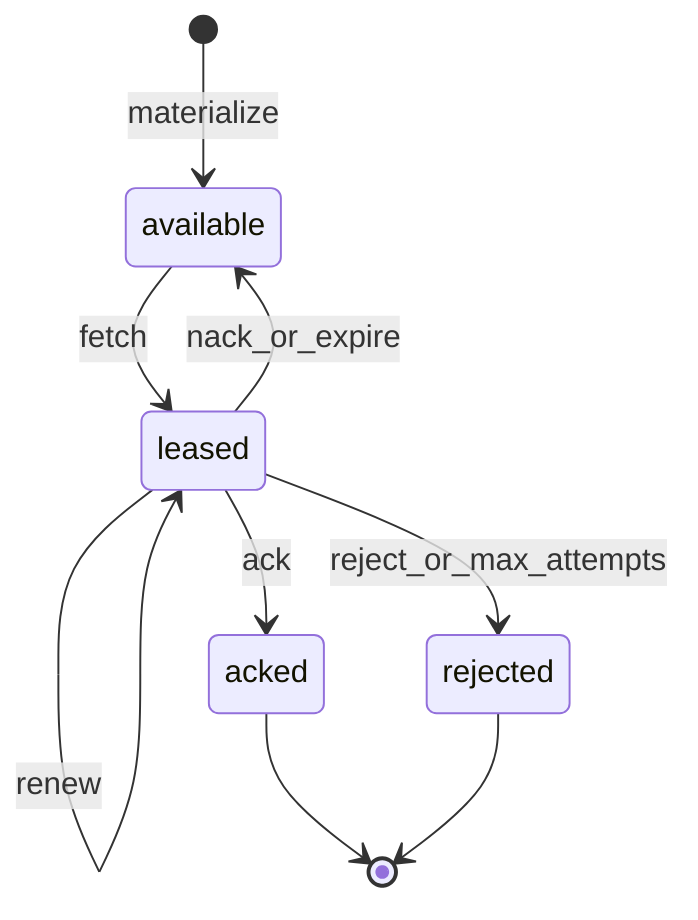
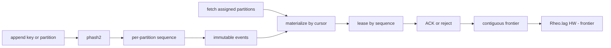
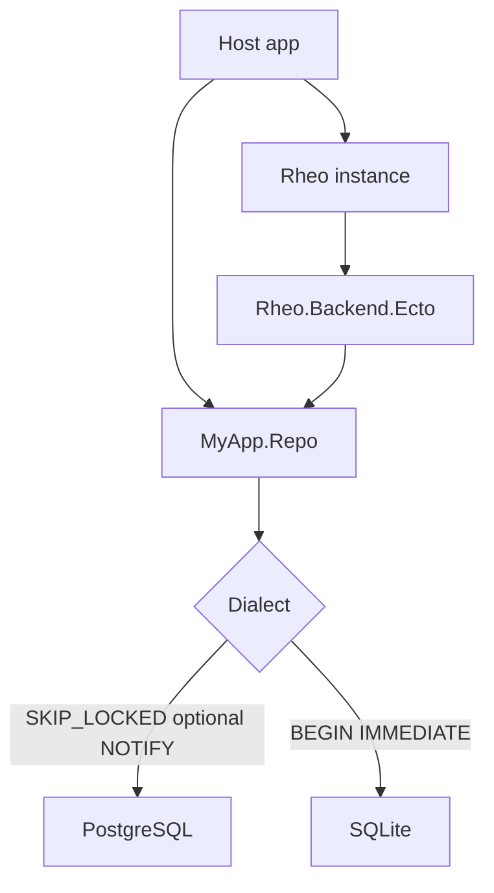
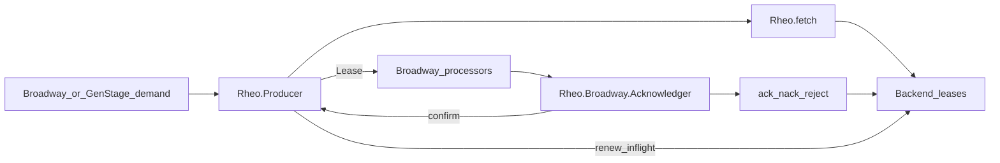

# Architecture and Flow Diagrams

Mermaid diagrams for Rheo architecture and flows. On HexDocs they render via
ExDoc's Mermaid integration; on GitHub they render natively in Markdown preview.

## Overall architecture

## OTP supervision

## Lease lifecycle

## Partitions and ACK frontier (v0.5)

Ordering is within a partition only. A hole (ACK 1001, inflight 1002, ACK 1003)
keeps the frontier at 1001 until 1002 is terminal.

## Ecto SQL backends (v0.6)

The host owns the Repo. Mongo stays on `Rheo.Backend.Mongo`; Ecto here means
SQL only (see ADR 017).

## Broadway / GenStage interop (v0.7)

The producer owns fetch and renewal; the acknowledger owns settle and reports
back with `Rheo.Producer.confirm/2` so renewal stops and demand is released
(see ADR 018).
