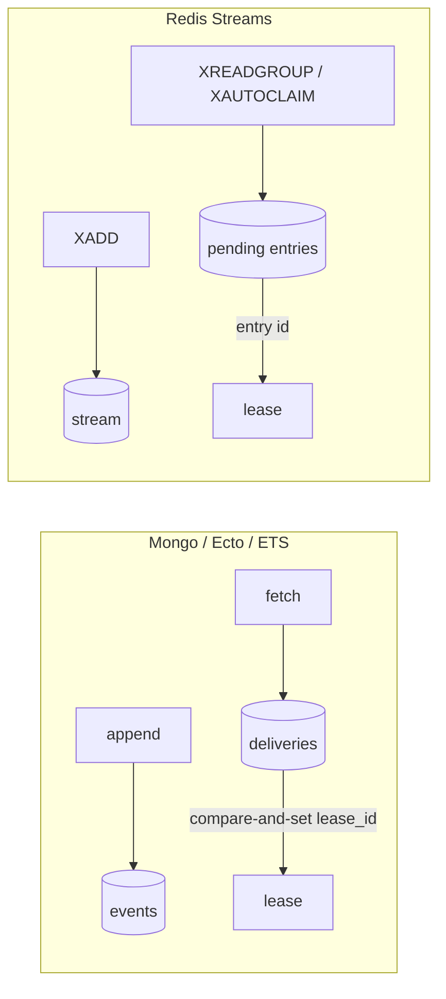
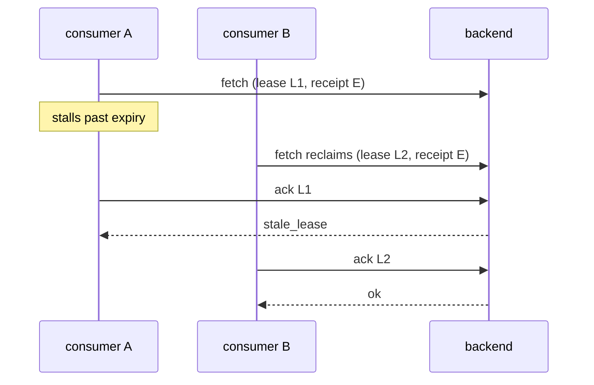
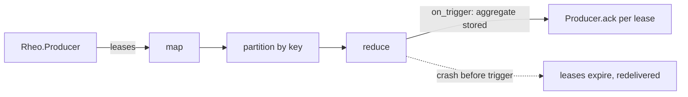

# Breaking Rheo Before Anyone Depends on the Wrong Abstraction

v0.1 through v0.7 were discovery releases. They proved that a consumer group
can live over a searchable database: an immutable log, leases with fencing
tokens, retries and dead-letters, partitions with a contiguous ACK frontier,
replay without copying events, an ETS reference backend, MongoDB, PostgreSQL
and SQLite through Ecto, and a GenStage producer that feeds Broadway.

v0.8 adds no backend. It is the release where the abstractions are corrected
while almost nobody depends on them.

## Why more backends expose false abstractions

The first backend defines the vocabulary. Rheo's vocabulary came from
MongoDB: a `deliveries` collection, a document per `{group, event}`, a
compare-and-set on `lease_id`. ETS and Ecto fit that shape, so three backends
passed the same conformance suite and the abstraction looked proven.

It was not. Three row-shaped stores agreeing with each other says nothing
about a store that already implements consumer groups.

## Why Redis Streams is different

Redis Streams has `XGROUP`, `XREADGROUP`, `XPENDING`, `XACK`, and
`XAUTOCLAIM`. The pending-entries list is the delivery table; the entry id is
the claim identity; reclaiming expired work is a server command. A Redis
backend that "materializes delivery documents" would be a second, slower
consumer-group implementation running on top of a native one.

Rheo must describe what a backend guarantees, not how it stores rows.

## Semantics versus mechanisms

The v0.8 backend contract keeps the same callbacks and changes their meaning
from storage algorithm to promise: `fetch` claims fenced leases, `ack` settles
only when the token still matches, `lag` reports a contiguous frontier.
Capabilities split the same way (`Rheo.Backend.Capabilities`): guarantees such
as `durable`, `partitions`, and `contiguous_frontier` gate conformance;
mechanisms such as `native_consumer_groups` or `blocking_reads` describe how
the backend gets there. `at_least_once` and `lease_fencing` cannot be declared
false.

## Logical sequence and native identity

Rheo orders events with an integer `sequence` per partition. Redis orders them
with entry ids like `1700000000000-0`. Replacing the sequence with an opaque
position would have made the frontier, lag, replay cursors, and every query
backend-specific. Keeping only the sequence would have forced Redis to look
up its own entries by a foreign key on every settle.

v0.8 keeps both: `event.sequence` stays the portable order, and
`lease.receipt` carries the backend's claim identity (ADR 021). Settle
callbacks fence on `lease_id` and, when set, on the receipt. A test double
shaped like a native stream runs the full conformance suite with exactly this
layout.

## One runtime, not two

`Rheo.Group` runs handler callbacks; `Rheo.Producer` satisfies GenStage
demand. They are different processes with different contracts, and by v0.7
they had grown two copies of lease renewal, fetch backoff, inflight tracking,
and drain. v0.8 moves the pure parts into `Rheo.Inflight` and `Rheo.Backoff`
and leaves each process with its effects. Draining no longer blocks the
coordinator: the caller is answered when inflight work settles.

## Callback state under concurrency

v0.7 handlers returned `{:ack, new_state}` while `concurrency: 8` ran eight
tasks against a snapshot of that state. Whichever task finished last won. The
documentation said "use an Agent"; the API said "this is GenServer state".

v0.8 removes the ambiguity: `handle_event(event, context)` receives a
read-only map built once by `setup/1` and returns `:ack`, `{:retry, reason}`,
or `{:reject, reason}`. State lives in processes the application owns.

The bridge process that started or joined a group is gone too. A consumer
module is now a child spec for `Rheo.Group`, the host supervisor owns it, and a
second consumer for the same `{rheo, stream, group}` fails to start.

## Settlement failures are explicit

A handler can succeed and the ACK can still fail. `Rheo.Settle` classifies the
failure (`:stale_lease`, `:backend_unavailable`, `{:failed, cause}`,
`{:ambiguous, cause}`, …) and the runtime acts on the class: a lost lease is
dropped, a definite failure is nacked, an unavailable or ambiguous outcome is
left to expire because the ACK may already be durable and fencing makes the
redelivery safe. Telemetry carries the class, not the driver exception.

## Dependencies in libraries

A library that hard-depends on `mongodb_driver`, `ecto_sql`, `gen_stage`, and
`broadway` makes every ETS-only user download all of them, and every new
backend makes it worse. v0.8 makes each integration optional: the dependency
is `optional: true` and the module is wrapped in a compile-time guard, so a
host compiles `Rheo.Backend.Mongo` only when it lists the driver. A check in
CI builds a project on Rheo with none of the integrations to keep the guards
honest (ADR 020).

## Why now

Rheo is pre-1.0 with a small user base. Each of these changes is a breaking
change; together they are one migration guide. After 1.0 the same corrections
would take a major version each and a compatibility layer in between.

## Conformance as the contract

The executable definition of a Rheo backend is `test/support/backend_contract.ex`,
grouped by guarantee: lifecycle, event log, queries, consumer groups, leases
and fencing, retry and reject, replay, partitions and frontier. ETS, Mongo,
SQLite, PostgreSQL, and the native-stream double run it. Correctness cases are
never skipped by capability; only cases for undeclared guarantees are.

## Flow: when is an input safe to settle?

Broadway settles one lease per message. Flow can partition, reduce, and window
many leases into one result, so the question changes from "did the handler
succeed" to "does the durable result this input contributed to exist yet".

The answer is the same helper Broadway uses: `Rheo.Producer.ack/3` from
`on_trigger` once the aggregate is durable, never from inside the reducer.
The Flow readiness tests exercise map, partition, reduce, window, and
crash-before-settle with no Flow-specific lease type.

## GenStage is the common boundary

Broadway and Flow both consume GenStage producers. `Rheo.Producer` is one
producer with one settlement model — `ack`, `nack`, `reject`, each releasing
the inflight entry — so neither integration needs its own renewal,
confirmation, or fencing code.

## What v0.9 will validate

`Rheo.Backend.Redis` will implement `Rheo.Backend` on `XADD`, `XREADGROUP`,
`XAUTOCLAIM`, a fenced `XACK`, and `XINFO GROUPS`, keeping a logical sequence
per partition and storing the entry id in `lease.receipt`. If it ships without
touching `Rheo.Consumer`, `Rheo.Group`, `Rheo.Event`, `Rheo.Query`, or the
frontier arithmetic, the reset did its job. Redis support does not exist in
v0.8.

## Read next

- [0.7 → 0.8 migration](https://hexdocs.pm/rheo/0-7-to-0-8.html)
- [ADR 019](https://hexdocs.pm/rheo/019-v0-8-architectural-reset.html)
- [Redis readiness spike](https://hexdocs.pm/rheo/redis-readiness-spike.html)
- [Flow readiness spike](https://hexdocs.pm/rheo/flow-readiness-spike.html)
