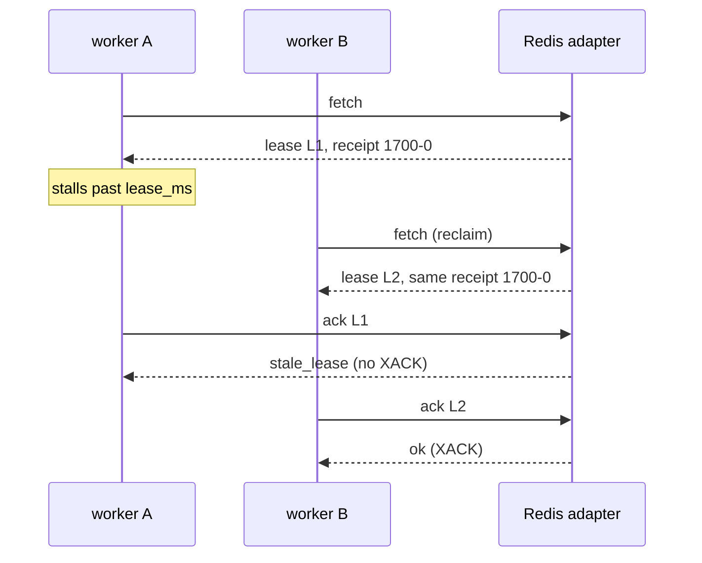

# Rheo on Redis Streams: Portable Sequence, Native PEL

v0.8 asked whether Rheo's abstractions could describe Redis Streams without
pretending Redis is a deliveries table. v0.9 answers in code:
`Rheo.Backend.Redis` on optional [Redix](https://hex.pm/packages/redix).

This article is the narrative companion to
[ADR 026](https://hexdocs.pm/rheo/026-redis-streams-backend.html) and the
[Redis guide](https://hexdocs.pm/rheo/redis.html). Article 15 set up the
question; this one records what shipped.

## The exit test, answered

Which core modules changed their *meaning* for Redis?

**None.** `Rheo.Consumer`, `Rheo.Event`, `Rheo.Query`, partition order, and
at-least-once / fencing invariants are the same as in v0.8. What landed is:

- optional `{:redix, "~> 1.5"}` and guarded `Rheo.Backend.Redis*` modules
- fence hashes + Redis Streams consumer groups under Model C
- ADR 025 wakeup (`wait/2` + reader Task); polling still the fallback
- docs, Livebook backends section, conformance tagged `:redis`

If you already write Option A handlers against ETS or Mongo, pointing the same
handler at Redis is a supervision-tree change, not a rewrite.

## Model C on a real PEL

Redis orders entries with ids like `1700000000000-0`. Rheo orders with a
portable integer `sequence` per partition. v0.9 keeps both (ADR 021):

| Rheo | Redis |
|---|---|
| `event.sequence` | Counter + ZSET index per partition |
| `lease.receipt` | Stream entry id |
| `lease.lease_id` | Fence hash field (Rheo fencing token) |
| `fetch` | `XREADGROUP` + reclaim via `XPENDING` / `XCLAIM` |
| `ack` | Fence check, then `XACK` |



`XACK` alone is not fencing. The adapter stores the current `lease_id` in a
per-entry fence hash and refuses settle when the caller's token is stale. That
is the same exercise Article 15 described with the native-stream double — now
against Redis 6.2+.

## Mechanisms without fake guarantees

Capabilities declare what Redis actually provides:

- `native_consumer_groups`, `native_pending_list`, `native_reclaim`,
  `blocking_reads`, `native_group_lag`
- `secondary_indexes: false` — `query` walks stream ranges and filters in the
  adapter; do not pretend RediSearch is on

Guarantees (`durable`, `distributed`, `partitions`, `contiguous_frontier`,
`replay`) stay honest. Conformance gates optional cases on those flags; it
never skips fencing.

## Wakeup without blocking the Group

A Redix connection that runs `XREAD … BLOCK` cannot also serve appends and
acks on the same TCP session. v0.9 starts **two** connections per instance:
the handle for commands, and a `….Waiter` used only by `wait/2`. The Group
(and Producer) keep their poll timers; a reader Task may send an early
`:fetch` hint (ADR 025). Lost wakeups only cost latency.

`:pool_size` is not supported yet — one command connection plus one waiter is
enough to prove the contract. Scale out with more BEAM nodes sharing one Redis
group, not with a silent pool inside the adapter.

## What you write

```elixir
children = [
  {Rheo,
   name: MyRheo,
   backend:
     {Rheo.Backend.Redis,
      name: MyRheo.Redis,
      url: System.get_env("RHEO_REDIS_URL", "redis://localhost:6379")}},
  {MyApp.RiskConsumer, rheo: MyRheo, concurrency: 8, max_demand: 100}
]
```

Handlers still return `:ack | {:retry, reason} | {:reject, reason}`. Broadway
still uses `Rheo.Producer` + `transformer: {Rheo.Broadway, :transform, []}`.
Receipts look different (`"1700-0"` instead of equalling `lease_id`); handlers
must not interpret them.

## How we know it works

- Shared backend contract suite tagged `:redis`
- Fencing and multi-instance Redis tests
- Property checks for contiguous sequences, frontiers, and stale tokens on Redis
- Broadway / Producer smoke against Redis (receipts through the acknowledger)
- `mix core.check` — Redis modules absent without Redix

## What v0.9 deliberately skips

- Redis Cluster multi-slot topology
- RediSearch as the query engine
- Lua scripts for append/ack (fence hashes + multi-command settle are enough
  for the fencing exercise today)
- Redix connection pools
- Ops / LiveDashboard surfaces (later roadmap)

## Takeaway

v0.8 fixed the abstractions so a native stream backend would not force another
core rewrite. v0.9 is that backend. Portable sequence, native PEL, fenced
settle, optional dependency — and the same Consumer API you already have.

Next: [Redis guide](https://hexdocs.pm/rheo/redis.html) ·
[0.8 → 0.9](https://hexdocs.pm/rheo/0-8-to-0-9.html) ·
[Article 15](https://hexdocs.pm/rheo/15-breaking-rheo-before-anyone-depends-on-the-wrong-abstraction.html) ·
[Livebook backends](https://hexdocs.pm/rheo/backends.html)
